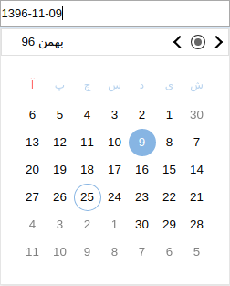
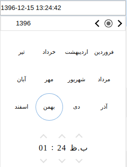

# Angular Jalali Date Picker
انتخاب گر تاریخ شمسی در انگولار 8 به بالا و کامپایلر IVY

## تصاویر

## فهرست مطالب :

 − [نصب کتابخانه](https://github.com/daustany/jalali-datepicker.git#installation)
 - [نحوه استفاده از انتخابگر تاریخ شمسی](https://github.com/daustany/jalali-datepicker.git#how_to_use)
 - [نمایش تاریخ انتخاب شده به صورت های مختلف در تاریخ خورشیدی](https://github.com/daustany/jalali-datepicker.git#how_to_use_the_output_as_a_jalali_shamsi_date)
 - [استفاده یا تغییر صفات انتخابگر تاریخ جلالی](https://github.com/daustany/jalali-datepicker.git#Attributes)
 - [تنظمات انتخابگر تاریخ فارسی](https://github.com/daustany/jalali-datepicker.git#Configuration)
 - [نحوه استفاده از انتخاب گر در داخل کلاس ها](https://github.com/daustany/jalali-datepicker.git#API)
 - [نحوه استفاده از انتخابگر به صورت همیشه ظاهر](https://github.com/daustany/jalali-datepicker.git#Inline_-_Day_Calendar)
 - [نحوه استفاده از انتخابگر مستقل از المنت ورودی](https://github.com/daustany/jalali-datepicker.git#Directive)
